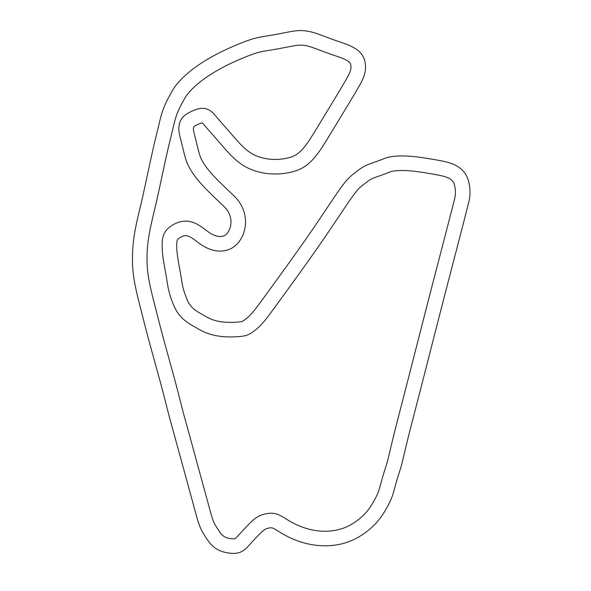
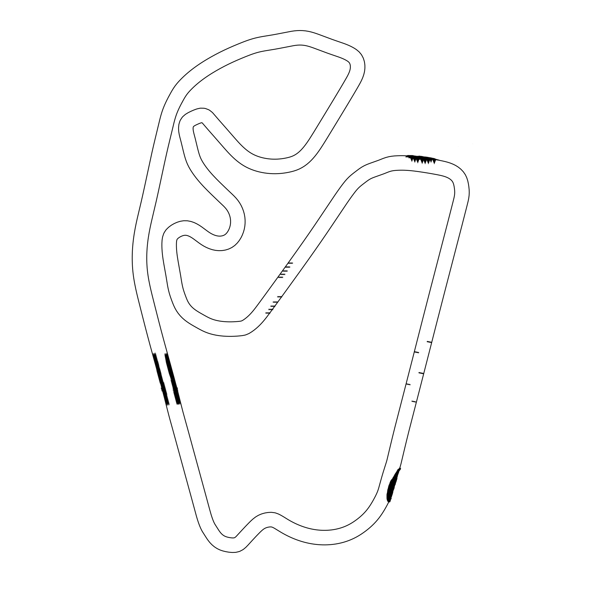

# Controlador reactivo Follow the Gap (F1Tenth): ftg_rv

Paquete ROS 2 (Humble, `ament_python`) que implementa un controlador reactivo
**Follow the Gap** para el simulador F1Tenth, con **contador de vueltas** y
**cronómetro por vuelta**. Proyecto del primer parcial de Vehículos Autónomos
(ESPOL). Mapa asignado: **SaoPaulo** (Interlagos).

El paquete soporta **tres escenarios ejecutables**, cada uno con su propio
mapa y su propio tuning:

| Escenario | Mapa | Parámetros | Comando |
|---|---|---|---|
| **Parte 1**: pista limpia | `maps/SaoPaulo_map` | `config/params.yaml` | `ros2 launch ftg_rv controller.launch.py` |
| **Parte 2**: obstáculos fijos | `maps/SaoPaulo_obs_map` | `config/params_obs.yaml` | `ros2 launch ftg_rv controller_obs.launch.py` |
| **Parte 2 + oponente**: obstáculos fijos y móvil | `maps/SaoPaulo_obs_map` | `params_obs.yaml` (ego) + `params_opp.yaml` (oponente) | `ros2 launch ftg_rv controller_opp.launch.py` |

Los tres comandos son **todo en uno** (simulador + controlador en una sola
terminal) y los dos mapas viajan **dentro de este paquete**, no hay que
descargar mapas ni editar la configuración del simulador.

---

## 1. Instalación

### 1.1 Prerrequisitos

- **ROS 2 Humble**: instalado siguiendo la
  [guía de instalación oficial](https://docs.ros.org/en/humble/Installation.html)
  (en Ubuntu 22.04, la vía recomendada es la de
  [paquetes deb](https://docs.ros.org/en/humble/Installation/Ubuntu-Install-Debs.html)).
- **Workspace del curso**: [F1Tenth-Repository](https://github.com/widegonz/F1Tenth-Repository)
  clonado en `~/F1Tenth-Repository`, con el simulador `f1tenth_gym_ros` ya
  compilado y funcionando (ver las instrucciones de su propio README).

### 1.2 Instalar este paquete

```bash
source /opt/ros/humble/setup.bash
cd ~/F1Tenth-Repository/src
git clone https://github.com/Raulvillaes/ftg_rv.git ftg_rv
cd ~/F1Tenth-Repository
colcon build --packages-select ftg_rv
source install/setup.bash
```

Los mapas SaoPaulo (limpio y con obstáculos) están incluidos en `maps/` de este paquete. El limpio
es el oficial de [f1tenth_racetracks](https://github.com/f1tenth/f1tenth_racetracks/tree/main/SaoPaulo).
Los launch apuntan el simulador a ellos en tiempo de ejecución, sin necesidad de editar el
`sim.yaml` del simulador.

## 2. Ejecución

Cada escenario se lanza de forma independiente, en **una sola terminal**;
abajo, los pasos. En todos los casos, la consola de `lap_timer_node` muestra
la meta fijada al arrancar y, al completar cada vuelta, el número de vuelta,
su tiempo y el acumulado:

```
============================================
  VUELTA 3 COMPLETADA
  Tiempo de vuelta:     61.42 s
  Tiempo acumulado:    184.90 s
============================================
```

Al completar `total_laps` (10 por defecto) se imprime la mejor vuelta y el
propio `launch` se cierra solo (simulador, RViz y controlador(es)), sin
necesidad de Ctrl+C:

```
##############################################
  10 VUELTAS COMPLETADAS - FIN DE LA PRUEBA
  Mejor vuelta:          38.70 s
  Tiempo total:         412.30 s
##############################################
```

### 2.1 Parte 1: pista limpia

Un solo comando levanta el simulador con el mapa SaoPaulo limpio y el
controlador con el tuning de `config/params.yaml`:

```bash
source /opt/ros/humble/setup.bash
cd ~/F1Tenth-Repository && source install/setup.bash
ros2 launch ftg_rv controller.launch.py
```

### 2.2 Parte 2a: obstáculos fijos

Un solo comando levanta el simulador con el mapa con obstáculos y el
controlador con el tuning de `config/params_obs.yaml` (conservador para sortear los obstáculos):

```bash
source /opt/ros/humble/setup.bash
cd ~/F1Tenth-Repository && source install/setup.bash
ros2 launch ftg_rv controller_obs.launch.py
```

No hace falta configurar el mapa en `sim.yaml`: los comandos incluyen el `sim.launch.py`
de este paquete, que recibe por argumentos: el mapa (en `/maps` de este paquete),
`stheta` (la orientación inicial del vehículo; girada a -60° en el mapa con obstáculos)
y `num_agent` (1 o 2), el resto (los tópicos, pose del oponente, etc.) se lee del
`sim.yaml` del simulador o de los overrides del propio launch.

### 2.3 Parte 2b: obstáculos fijos y vehículo móvil

Un solo comando levanta el simulador con el mapa con obstáculos, el ego y un
**vehículo oponente** que corre el mismo controlador Follow the Gap a menor
velocidad (tope 6 m/s frente a los 10 m/s del ego):

```bash
source /opt/ros/humble/setup.bash
cd ~/F1Tenth-Repository && source install/setup.bash
ros2 launch ftg_rv controller_opp.launch.py
```

No hay código nuevo para el oponente: es una segunda instancia de
`reactive_node` remapeada a los tópicos del segundo coche del bridge
(`/opp_scan`, `/opp_drive`) con su propio yaml de parámetros. El simulador
**no avanza hasta que ambos coches publican su comando de manejo**.

En la consola, los logs de cada nodo se distinguen por su nombre:
`[reactive_node]` es el Follow the Gap del ego, `[opp_reactive_node]` el del
oponente y `[lap_timer_node]` el contador de vueltas y cronómetro. Este
escenario lanza `lap_timer_node` **solo para el ego**: el oponente no cuenta
vueltas, así la consola del video de evidencia no mezcla el conteo de los
dos autos (ver sección 5).

### 2.4 Tunear parámetros

Editar `config/params.yaml` (Parte 1), `config/params_obs.yaml` (Parte 2,
ego) o `config/params_opp.yaml` (oponente), volver a ejecutar
`colcon build --packages-select ftg_rv` y relanzar el controlador.
La lista completa de parámetros está en la sección 6.

## 3. Topics

Dos nodos, cada uno con su propia responsabilidad y sus propios tópicos:

| Nodo | Tópico | Tipo | Dirección | Uso |
|---|---|---|---|---|
| `reactive_node` | `/scan` | `sensor_msgs/LaserScan` | Suscripción | Entrada del pipeline Follow the Gap (`lidar_callback`) |
| `reactive_node` | `/drive` | `ackermann_msgs/AckermannDriveStamped` | Publicación | Comando de dirección y velocidad (`publish_drive`) |
| `lap_timer_node` | `/ego_racecar/odom` | `nav_msgs/Odometry` | Suscripción | Contador de vueltas y cronómetro (`odom_callback`) |

`reactive_node.py` no sabe nada de vueltas ni de odometría: solo percibe
(`/scan`) y actúa (`/drive`). En el oponente, `controller_opp.launch.py`
remapea `/scan` y `/drive` a `/opp_scan` y `/opp_drive` (los tópicos del
segundo coche del bridge); el código del nodo no cambia. `lap_timer_node` es
independiente de `reactive_node` y solo se lanza para el ego (ver sección 5).

## 4. Enfoque: el algoritmo Follow the Gap

Follow the Gap es un algoritmo **reactivo**: no usa mapa ni planificación
global; decide cada comando de dirección y velocidad mirando únicamente el
scan actual del LiDAR. La idea central es *apuntar siempre hacia el hueco
libre más grande*, esquivando implícitamente los obstáculos. Por eso el mismo
controlador sirve para todos los escenarios sin cambios de lógica, solo cambia
el tuning (incluso el oponente es este mismo nodo remapeado).

Sobre cada mensaje de `/scan` (a ~250 Hz) se ejecuta este pipeline:

1. **Recorte del FOV** (`_compute_fov_indices`): el LiDAR cubre ~270°, pero
   solo interesan los rayos delanteros (±90° por defecto). Lo que queda
   detrás del auto no ayuda a decidir hacia dónde avanzar.

2. **Preprocesado** (`preprocess_lidar`):
   - Lecturas inválidas (`NaN`) se tratan como obstáculo (0 m).
   - Lecturas infinitas o enormes se **saturan** a `max_range` (10 m): sin
     esto, una lectura de 30 m dominaría siempre la elección del objetivo.
   - **Media móvil** de `smoothing_window` rayos: elimina ruido puntual del
     sensor sin deformar la geometría de la pista.

3. **Burbuja de seguridad** (`apply_safety_bubble`): se busca el punto más
   cercano del scan y se anulan (distancia = 0) todos los rayos dentro de un
   radio físico `bubble_radius` a su alrededor. El radio en metros se
   convierte a número de rayos con `arctan(radio / distancia)`: el mismo
   obstáculo ocupa más rayos cuanto más cerca está. Esta burbuja es lo que
   obliga al auto a *rodear* el obstáculo más próximo en vez de rozarlo.

4. **Gap máximo** (`find_max_gap`): se umbraliza el scan (`gap_threshold`,
   rayos con más de 2 m son "libres") y se busca la **racha contigua más
   larga** de rayos libres, de forma vectorizada con NumPy.

5. **Mejor punto** (`find_best_point`): dentro del gap se mezcla el punto
   **más lejano** (rápido: apura las curvas) con el **centro del gap**
   (seguro: se aleja de las paredes) según `best_point_bias`
   (0.0 = solo el más lejano, 1.0 = solo el centro). Es el ajuste principal
   de tuning del comportamiento en curva. Detalle importante: en rectas
   largas muchos rayos saturan a `max_range` y empatan como "más lejano";
   entre los empatados se elige el más cercano al centro del gap, porque
   `argmax` a secas devolvería el borde del empate y el auto zigzaguearía
   (frenándose) en plena recta.

6. **Actuación**: el índice del mejor punto se convierte a ángulo real del
   rayo (`angle_min + índice · angle_increment`), se satura al límite físico
   del servo (±0.42 rad) y se publica en `/drive`. La **velocidad es el
   mínimo de dos criterios independientes** (`compute_speed`):
   - *Por ángulo de volante* (escalonada): `max_speed` casi recto,
     `mid_speed` en curvas suaves y `corner_speed` en curvas cerradas.
   - *Por espacio libre al frente* (lineal): `corner_speed` con
     `brake_distance` o menos de pista libre, `max_speed` a partir de
     `full_speed_distance`. Sin este criterio el auto aceleraría en el
     vértice de la curva (donde el volante apunta momentáneamente recto a
     la salida) y no frenaría al final de las rectas; con él, frena
     *entrando* a la curva y acelera *saliendo*, como se espera.

Si ningún rayo supera el umbral (no hay gap), el auto apunta al rayo
más largo disponible a velocidad de curva.

## 5. Contador de vueltas y cronómetro

Viven en un nodo aparte, `lap_timer_node.py`, suscrito únicamente a
`/ego_racecar/odom` (no toca `/scan` ni `/drive`). Está separado de
`reactive_node` a propósito: cuando `controller_opp.launch.py` lanza una
segunda instancia de `reactive_node` remapeada como oponente, esa instancia
no imprime ningún conteo de vueltas propio, porque `lap_timer_node` solo se
lanza una vez, para el ego. Así la consola del video de evidencia muestra
un único contador y cronómetro, sin mezclarse con el auto oponente.

Toda la lógica vive en `odom_callback`:

- **Meta**: la posición del *primer* mensaje de odometría (donde aparece el
  auto). Una vuelta se cuenta cuando el auto vuelve a entrar al círculo de
  radio `finish_line_tolerance` alrededor de la meta.
- **Anti doble conteo** (dos protecciones independientes):
  - *Histéresis*: tras contar una vuelta hay que **salir** del círculo
    (alejarse a más de 2× la tolerancia) antes de poder contar la siguiente.
  - *Tiempo mínimo de vuelta* (`min_lap_time`): cruces separados por menos
    de 10 s se ignoran.
- **Cronómetro**: usa `self.get_clock().now()` (reloj de ROS). Al completar
  cada vuelta se imprime en consola el bloque mostrado en la sección 2.
- **Fin de la prueba**: al llegar a `total_laps` vueltas se imprime la mejor
  vuelta y se llama a `rclpy.shutdown()`, lo que termina el proceso de
  `lap_timer_node`. Los tres launch (`controller*.launch.py`) registran un
  `RegisterEventHandler(OnProcessExit(...))` sobre ese nodo que, al detectar
  su salida, emite un evento `Shutdown()` propagado a todo el árbol de
  lanzamiento (simulador, RViz, `reactive_node` y, en la Parte 2 con
  oponente, también `opp_reactive_node`). Así el comando `ros2 launch` entero
  termina solo, sin Ctrl+C manual.

## 6. Estructura del código

```
ftg_rv/
├── ftg_rv/
│   ├── reactive_node.py            # Follow the Gap: /scan -> /drive (un nodo, sin vueltas)
│   └── lap_timer_node.py           # Contador de vueltas y cronometro: /ego_racecar/odom
├── launch/
│   ├── sim.launch.py               # Simulador con mapa de este paquete (args: map, stheta, num_agent)
│   ├── controller.launch.py        # Parte 1: sim (mapa limpio) + reactive_node + lap_timer_node
│   ├── controller_obs.launch.py    # Parte 2: sim (mapa obs) + reactive_node + lap_timer_node
│   └── controller_opp.launch.py    # Parte 2.5: sim (mapa obs, 2 agentes) + ego + lap_timer_node + oponente
├── config/
│   ├── params.yaml                 # Tuning Parte 1 (reactive_node + lap_timer_node)
│   ├── params_obs.yaml             # Tuning Parte 2, obstáculos (reactive_node + lap_timer_node)
│   └── params_opp.yaml             # Tuning del oponente (solo reactive_node, más lento que el ego)
├── maps/
│   ├── SaoPaulo_map.png/.yaml      # Mapa SaoPaulo oficial (f1tenth_racetracks)
│   └── SaoPaulo_obs_map.png/.yaml  # El mismo mapa con los obstáculos fijos
├── package.xml / setup.py / setup.cfg
└── README.md
```

### Funciones principales de `reactive_node.py` (percepción y control):

| Función | Qué hace |
|---|---|
| `lidar_callback` | Orquesta el pipeline Follow the Gap y publica `/drive` |
| `_compute_fov_indices` | Calcula (una vez) los índices del recorte de FOV |
| `preprocess_lidar` | Limpieza de NaN/inf, saturación y suavizado |
| `apply_safety_bubble` | Anula los rayos alrededor del punto más cercano |
| `find_max_gap` | Racha contigua más larga de rayos libres |
| `find_best_point` | Mezcla lejano/centro del gap (`best_point_bias`) |
| `compute_speed` | Mínimo entre velocidad por ángulo y por espacio libre |
| `publish_drive` | Publica el `AckermannDriveStamped` con el clamp del servo |

### Funciones principales de `lap_timer_node.py` (vueltas y cronómetro):

| Función | Qué hace |
|---|---|
| `odom_callback` | Fija la meta, cuenta vueltas (histéresis + tiempo mínimo), imprime el cronómetro y, al llegar a `total_laps`, imprime la mejor vuelta y cierra el nodo (`rclpy.shutdown()`) |

## 7. Mapas

Los píxeles negros son interpretados como espacio ocupado por el simulador y el
`map_server`. Ambos mapas viajan en `maps/` de este paquete y se instalan en su
share con el `colcon build`.

### Mapa Limpio (`SaoPaulo_map`)
Es el mapa SaoPaulo oficial de `f1tenth_racetracks`:



### Mapa con Obstáculos
Los 5 obstáculos fijos de la Parte 2 se dibujaron directamente sobre una
copia del PNG con GIMP, renombrada a `SaoPaulo_obs_map.png`:



El mapa cuenta con su propio yaml de metadatos. Como la imagen conserva
las dimensiones del original (2000×2000 px), la resolución y el origen
del yaml no cambian.


## 8. Integración sin modificar el simulador

### sim.launch.py

Para usar los mapas sin modificar el simulador, `sim.launch.py` replica
los nodos de `gym_bridge_launch.py` pero pasa dos fuentes de parámetros al
bridge: `[sim.yaml, <overrides del escenario>]`. En `launch_ros` la última
fuente gana, así que solo se sobreescriben el mapa (argumento `map`), la
orientación inicial del ego (argumento `stheta`), `num_agent` y la pose
inicial del oponente; el resto de la configuración sigue viniendo del
`sim.yaml` del simulador. Ventaja práctica: no hay que descargar mapas,
editar `map_path` en `sim.yaml` ni recompilar el simulador para alternar
entre escenarios.

### El oponente

El bridge del simulador soporta un segundo coche (`num_agent: 2`) con sus
propios tópicos: `/opp_scan`, `/opp_racecar/odom` y `/opp_drive`. El
oponente de `controller_opp.launch.py` es **el mismo `reactive_node`**
lanzado una segunda vez con esos tópicos remapeados y el tuning más lento de
`params_opp.yaml`: al ser Follow the Gap un algoritmo puramente reactivo, el
mismo código conduce cualquier coche que le dé un LiDAR y acepte comandos
Ackermann. Su pose inicial se coloca sobre la línea de carrera, por delante
del ego, para que actúe como tráfico móvil a alcanzar y esquivar.

## 9. Parámetros

Cada escenario carga su propio yaml (sección 2.4). Valores actuales:

#### Parámetros de `reactive_node` (percepción y control)

| Parámetro | Parte 1 | Parte 2 | Significado |
|---|---|---|---|
| `max_speed` | 12.0 m/s | 10.0 m/s | Velocidad en recta |
| `mid_speed` | 7.0 m/s | 6.5 m/s | Velocidad en curva suave |
| `corner_speed` | 4.0 m/s | 3.0 m/s | Velocidad en curva cerrada |
| `steering_threshold_low/high` | 10° / 20° | 10° / 20° | Umbrales de los 3 niveles de velocidad |
| `brake_distance` | 2.5 m | 4.0 m | Espacio libre frontal al que se va a `corner_speed` |
| `full_speed_distance` | 8.0 m | 8.0 m | Espacio libre frontal que permite `max_speed` |
| `fov_angle` | 90° | 90° | Semiancho del FOV útil |
| `smoothing_window` | 5 | 5 | Ventana de la media móvil |
| `max_range` | 10.0 m | 10.0 m | Saturación del LiDAR |
| `gap_threshold` | 2.0 m | 2.0 m | Distancia mínima de un rayo "libre" |
| `bubble_radius` | 0.4 m | 0.4 m | Radio de la burbuja de seguridad |
| `best_point_bias` | 0.4 | 0.3 | 0 = punto más lejano, 1 = centro del gap |

#### Parámetros de `lap_timer_node` (vueltas y cronómetro)

Misma clave (`lap_timer_node: ros__parameters:`) en `params.yaml` y
`params_obs.yaml`; no existen en `params_opp.yaml` porque el oponente no
lleva este nodo (sección 5):

| Parámetro | Valor | Significado |
|---|---|---|
| `finish_line_tolerance` | 4.0 m | Radio de detección de la meta |
| `min_lap_time` | 10.0 s | Tiempo mínimo entre cruces de meta |
| `total_laps` | 10 | Vueltas antes de imprimir la mejor y cerrar el `launch` completo |

Lógica del tuning de cada parte:

- **Parte 1** (pista limpia): ajustado iterativamente en SaoPaulo. La
  configuración inicial conservadora (5.0/3.0/1.5 m/s, sin freno por espacio
  libre) daba vueltas de ~67 s; la final logra **~38.7 s por vuelta** de
  forma estable y sin colisiones.
- **Parte 2** (obstáculos): más conservador donde importa para sobrevivir al
  zigzag: menor tope en recta (10 m/s), `corner_speed` más bajo (3.0 m/s) y
  frenado más anticipado (`brake_distance` 4.0 m) que en la Parte 1, y
  `best_point_bias` 0.3 para apuntar algo más lejos dentro del gap y suavizar
  la trayectoria entre paredes alternadas.
- **Oponente** (`params_opp.yaml`): igual que la Parte 2 pero con velocidades
  reducidas (6.0 / 4.5 / 3.0 m/s): debe ser claramente más lento que el ego
  para actuar como tráfico móvil, pero conservar el mismo comportamiento
  reactivo para sobrevivir él también a los obstáculos fijos.

## 10. Videos

Video de evidencia por escenario: vehículo recorriendo la pista con el
contador de vueltas y el cronómetro visibles en consola (sección 2).

| Escenario | Video |
|---|---|
| **Parte 1** — pista limpia | [youtu.be/ICsL-3kO60Q](https://youtu.be/ICsL-3kO60Q) |
| **Parte 2a** — obstáculos fijos | [youtu.be/NMpa-V67cUA](https://youtu.be/NMpa-V67cUA) |
| **Parte 2b** — obstáculos fijos y vehículo móvil | [youtu.be/d-CdtewpTTA](https://youtu.be/d-CdtewpTTA) |

---

**Autor:** Raulvillaes — Vehículos Autónomos, ESPOL.
